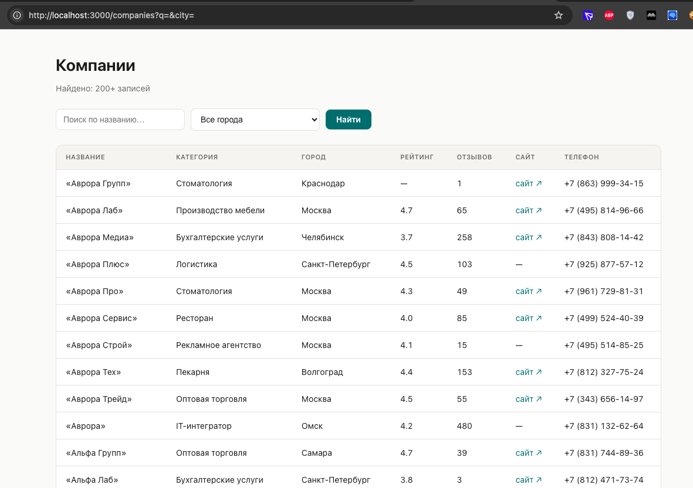
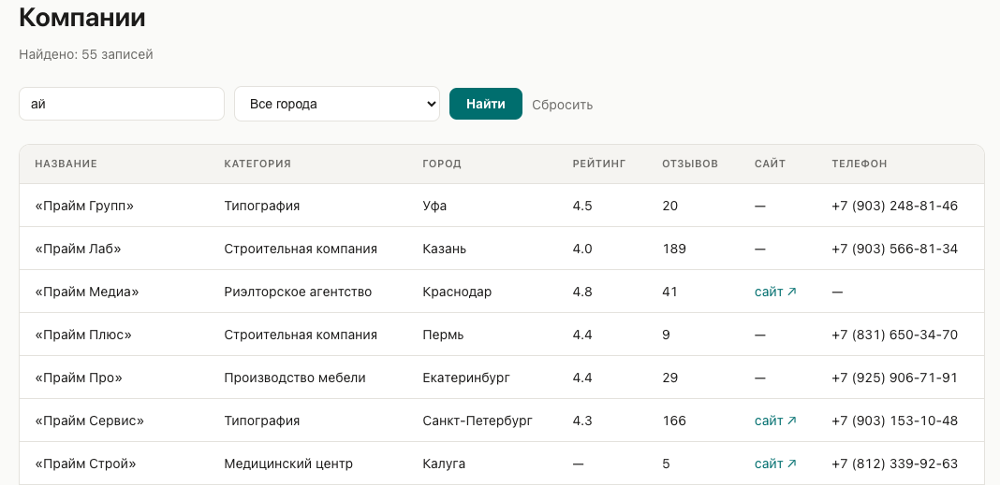
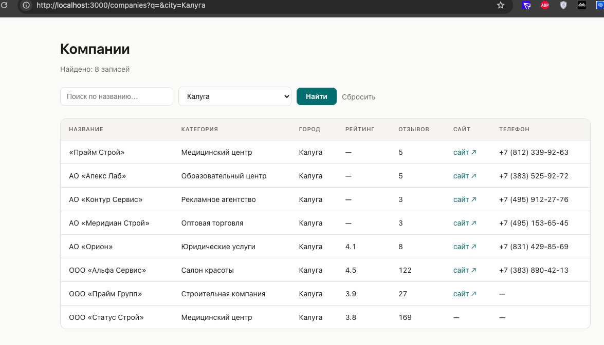
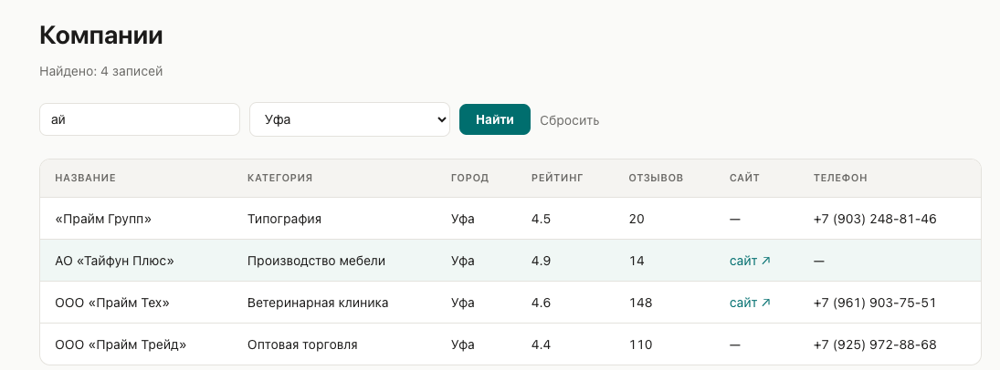
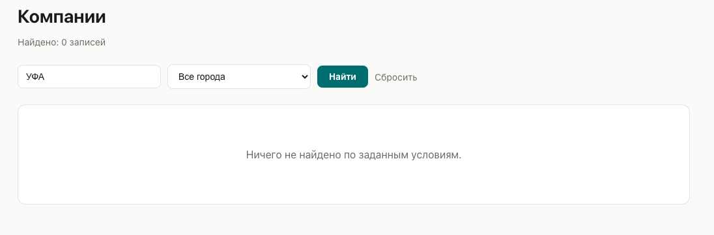
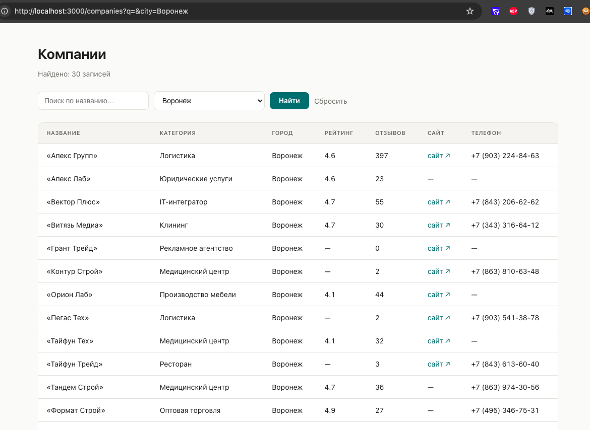
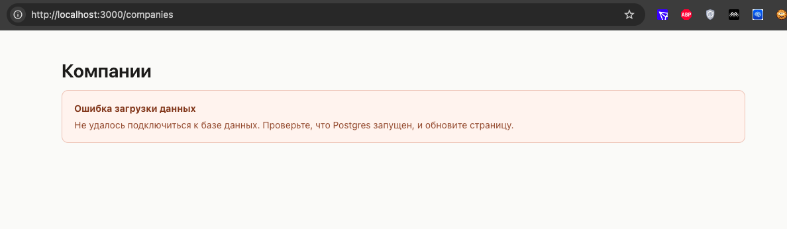

# Companies dashboard (Next.js)

Страница `/companies`: таблица компаний из Postgres (см. репозиторий из задачи 1)
с поиском по названию и фильтром по городу. Данные тянутся серверно —
`app/companies/page.tsx` это React Server Component, который на каждый запрос
ходит напрямую в Postgres через `lib/companies.ts` (без клиентского fetch и
без экспонирования БД наружу).

Поиск и фильтр реализованы обычной GET-формой без JS: состояние живёт в
query-параметрах `?q=...&city=...`, поэтому отфильтрованным видом можно
поделиться ссылкой, а страница работает даже без JavaScript в браузере.

## Требования

- Node.js 20+
- Запущенная Postgres-база из задачи 1 (`docker compose up -d` в том репозитории)
  с уже загруженными данными

## Запуск

```bash
npm install

cp .env.example .env.local
# при необходимости поправьте DATABASE_URL в .env.local под свою БД

npm run dev
```

Открыть [http://localhost:3000/companies](http://localhost:3000/companies).

`.env.local` игнорируется git'ом (см. `.gitignore`) — в репозитории лежит
только `.env.example` с плейсхолдером, реальных секретов в коде нет.

## Структура

```
.
├── app/
│   ├── layout.tsx        # корневой layout, метаданные
│   ├── page.tsx           # заглавная страница со ссылкой на /companies
│   ├── globals.css
│   └── companies/
│       └── page.tsx       # Server Component: поиск + фильтр + таблица
├── lib/
│   ├── db.ts               # пул подключений к Postgres (pg)
│   └── companies.ts        # параметризованные SQL-запросы
├── .env.example
└── package.json
```

## Доказательство, что работает

### Скриншоты

*(вставить сюда 2–3 скриншота: страница без фильтров, страница с поиском по
названию, страница с выбранным городом)*

`[screenshot: /companies без фильтров]`
`[screenshot: /companies с поиском "ООО"]`
`[screenshot: /companies с фильтром по городу]`

### Как проверял

*(TODO — заполнить по факту своего тестирования, 3–5 предложений: что именно
кликал/вводил, что сломалось в процессе и как правил. Ниже — чек-лист того,
что стоит реально прогнать руками перед тем как писать этот раздел)*

- [ ] Страница `/companies` открывается и показывает все компании без фильтров

- [ ] Поиск по частичному совпадению названия

- [ ] Фильтр по городу через select

- [ ] Поиск + фильтр по городу одновременно

- [ ] Поиск, который не даёт ни одного результата (пустое состояние)

- [ ] Кнопка "Сбросить" возвращает к списку без фильтров

- [ ] Строка без сайта/телефона/рейтинга — что рендерится вместо `NULL`

- [ ] Обновление страницы (F5) с параметрами в URL — фильтры сохраняются,
      т.к. состояние в query-параметрах, а не в клиентском стейте

- [ ] Что происходит при остановленной БД (`docker compose stop`)

